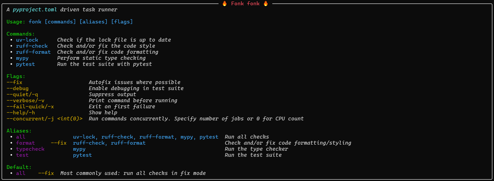

<div align="center">

# Fonk

Fonk is an open-source command runner that is fully configured via `pyproject.toml`.



</div>

## Usage

First add an entry into your `pyproject.toml` file that contains the command you want to run:

```toml
[tool.fonk.command.my_command]
description = "Run my command"
arguments = ["echo", "Hello, World!"]
type = "shell"
``` 

Then run the command using the following command:

```bash
uvx fonk my_command
```

### Flags

You can define flags for your command. For example, to define a flag that changes the output of your command:

```toml
[tool.fonk]
flags = [
    { name = "love", shorthand = "l", description = "Show love" }
]

[tool.fonk.command.my_command]
description = "Run my command"
arguments = ["echo", "Hello, World!"]
type = "shell"
flags = [
    { on = "love", remove = ["Hello, World!"], add = ["I love you, World!"] }
]
```

Then run the command with the flag:

```bash
uvx fonk my_command --love
```

You'll note that we had to add the flag in the flags table as well as in the command table. This is because the flag is a global flag that can be used with any command. The `on` field in the flag table specifies the flag that the command should listen to. The `remove` field specifies the arguments that should be removed when the flag is used. The `add` field specifies the arguments that should be added when the flag is used.

There are a number of built in flags that change the behaviour of fonk itself, but can also affect your commands. These are:

- `--help` or `-h`: Shows the help message for the command. Cannot reach your command.
- `--quiet` or `-q`: Runs the command in quiet mode, which suppresses all output.
- `--verbose` or `-v`: Runs the command in verbose mode, which shows all output.
- `--fail-quick` or `-x`: Stops the command as soon as an error is encountered.
- `--concurrent` or `-j`: Runs the command concurrently.

## Contributing

We welcome contributions from the community. To contribute to Fonk, follow these steps:

1. Fork the repository.
2. Create a new branch (`git checkout -b feature-branch`).
3. Make your changes.
4. Commit your changes (`git commit -m 'feat: Add new feature'`).
5. Push to the branch (`git push origin feature-branch`).
6. Open a pull request.

Please ensure your code adheres to our coding standards. Since this is a task runner, the required CI steps are also defined as Fonk commands in the `pyproject.toml` file. Simply use `uv run fonk` to run all steps.

## License

Fonk is licensed under the MIT License. See the [LICENSE](./LICENSE.md) file for more details.

## Contact

For any questions or feedback, please open an issue on the [GitHub repository](https://github.com/yourusername/fonk).
